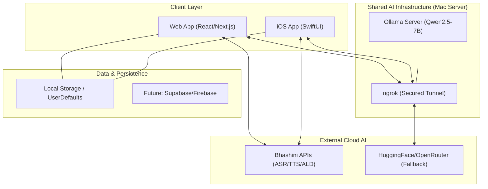
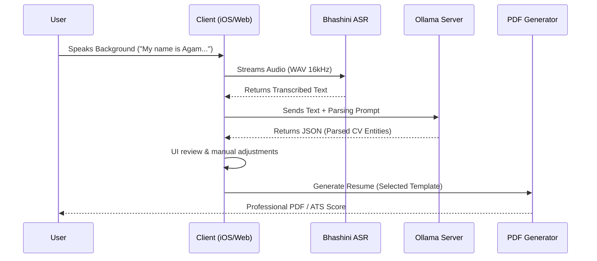

# S4CV_Public_Repo
# S4CV - AI-Powered Voice Resume Builder 📱🎙️💻

**A multi-platform intelligent resume builder featuring conversational voice input, multilingual AI content extraction, and professional PDF generation.**

**Version 2.2** | **Platform Status: Production Ready (iOS) / Enterprise Ready (Infrastructure)**

---

## 📖 Introduction

**S4CV** (Speech-for-CV) is a state-of-the-art platform designed to democratize professional opportunities. By combining **Conversational AI** with **Multilingual Speech Recognition**, S4CV allows anyone—from tech professionals to low-literacy users—to create high-quality, ATS-optimized resumes just by speaking in their native language.

The platform is built on a **Hybrid AI Architecture**, leveraging local LLMs (Ollama) for privacy and cost-efficiency, and government-backed services (Bhashini) for industry-leading Indian language support.

---

## 🏗️ Architectural Design

S4CV follows a **Distributed Platform Architecture** where multiple client interfaces (iOS and Web) consume a unified, self-hosted AI Service layer.

### 1. High-Level Platform Overview

### 2. Multi-Tier AI Fallback Strategy
To ensure 100% availability and high accuracy, S4CV implements a unique 3-tier parsing logic:

1.  **Tier 1: Local Ollama (Primary)** - Hosted on a dedicated Mac server via ngrok. Secure, private, and zero cost per token.
2.  **Tier 2: Cloud LLM (Fallback)** - Qwen2.5-Instruct via HuggingFace or OpenRouter for high-concurrency needs.
3.  **Tier 3: IL-NER (Local Fallback)** - A lightweight, rule-based Named Entity Recognition engine that works fully offline using a database of 1000+ Indian entities.

### 3. Voice-to-Resume Sequence Diagram

---

## 🌟 Key Features

### 🎙️ Conversational Modes
| Feature | Low-Literacy Mode | Professional Mode |
| :--- | :--- | :--- |
| **Workflow** | Guided AI Interview | Natural Narrative |
| **Interaction** | AI asks questions one-by-one | User speaks freely in one go |
| **Language** | Full Audio feedback (TTS) | Text-based confirmation |
| **Target** | Users unfamiliar with CV structure | Experienced tech professionals |

### 🌐 Multilingual Prowess
- **11+ Indian Languages**: English, Hindi, Bengali, Tamil, Telugu, Marathi, Gujarati, Kannada, Malayalam, Punjabi, and more.
- **Code-Mixed Support**: Intelligent parsing of "Hinglish" or other mixed-language narratives.
- **Auto-Script Detection**: Automatically identifies script (Devanagari, Telugu, etc.) for optimal transcription accuracy.

### 📄 Professional PDF Exports
- **8 Dynamic Templates**: From "Executive Suite" to "Developer Dark".
- **ATS Optimization**: Resumes structured to pass modern Applicant Tracking Systems.
- **Document Attachment**: Auto-append high-resolution photos of certificates, degrees, and awards to the final PDF.

---

## 🛠 Technology Stack

### Client Side (iOS)
- **Framework**: SwiftUI (Swift 5.0+)
- **Audio**: AVFoundation (PCM 16kHz mono)
- **PDF Engine**: PDFKit with Custom Layout Engines
- **State Management**: ObservableObject & Combine

### Infrastructure (Mac 2 Server)
- **Core**: Ollama serving `Qwen2.5-7B-Instruct`
- **Connectivity**: ngrok for stable, encrypted HTTPS tunneling
- **Networking**: URLSession with custom retry & fallback logic

### AI Services
- **ASR/TTS/ALD**: Bhashini (Government of India)
- **NER**: Custom IL-NER Pattern Matcher (IIIT Hyderabad datasets)
- **LLM**: Qwen2.5 (95% extraction accuracy)

---

## 🚀 Setup & Installation

### iOS Client Setup
1.  **Clone**: `git clone <repo-url>`
2.  **Open**: `open S4CV.xcodeproj` in Xcode 15+.
3.  **Config**: Ensure `APIConfig.swift` points to your active Ollama ngrok URL.
4.  **Run**: Press **Cmd + R** on a physical device or simulator.

### AI Server Setup (Local LLM)
1.  **Install Ollama**: `brew install ollama`
2.  **Pull Model**: `ollama pull qwen2.5:7b`
3.  **Start Server**: `OLLAMA_HOST=0.0.0.0:11434 ollama serve`
4.  **Expose via ngrok**: `ngrok http 11434`
5.  **Configure**: Update the `publicOllamaURL` in `APIConfig.swift` with the ngrok link.

---

## 🔮 Roadmap
- [ ] **Full Web Interface**: React-based portal sharing the same AI logic.
- [ ] **Cloud Persistence**: Migration from UserDefaults to Supabase.
- [ ] **Real-time Collaboration**: Shared resume editing.
- [ ] **Advanced ATS Scoring**: In-depth feedback on resume quality vs. job descriptions.

---

Developed with ❤️ by the S4CV Team

